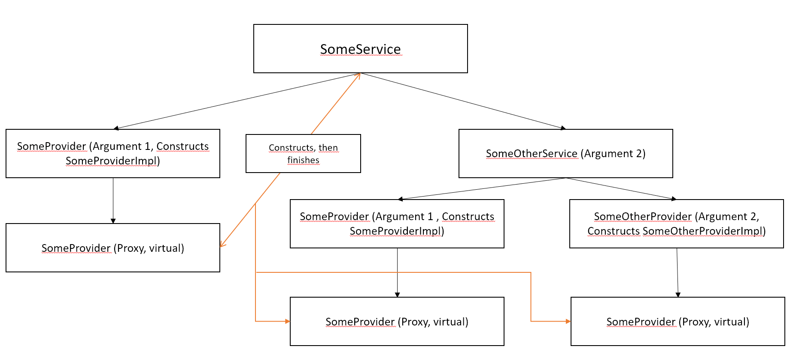

Aerogel  
===========

A lightweight dependency injection framework for Java 11 - 22 which aims for stability, performance and reliability.
Aerogel is fully compliant with [JSR 330](https://jcp.org/en/jsr/detail?id=330) and the [Jakarta Dependency Injection
Specification](https://jakarta.ee/specifications/cdi/2.0/cdi-spec-2.0.html) and supports bidirectional proxies to break
circular references.

### How to (Core)

The api for aerogel is directly packaged with the internal core to run the framework. The following annotations are used
for the core injection:

- `@Inject`: the core annotation when trying to inject. Applied to a constructor it indicates which constructor should
  be used for class creating, applied to class members it indicates which members should be injected after a successful
  construction.
- `@Named`: a build-in qualifier annotation which - applied to a parameter or field - sets an extra name property in an
  element allowing multiple instances of a type to be distinguished (a name annotation can be generated and applied to
  an element using the Qualifiers utility class).
- `@ProvidedBy`: an annotation which - applied to a type - signals the injector that the requested instance is not
  implemented by the current class but the class given as the annotation's value.
- `@Qualifier`: Identifies qualifier annotations. When constructing an element, qualifier annotations will be detected
  on fields and parameters and applied as special properties to an element. See down below for an example (In this
  case `@Greeting` and `@GoodBye`).
- `@Scope`: Identifies a scope annotation. When a binding is constructed all scopes will be resolved from the parent
  injector which is requesting the binding. Scopes are used to re-use the same constructed instance of a class multiple
  times within a specified context.
- `@Singleton`: A scope which signals an injector that an instance of the class should only get created once per
  injector chain. The annotation is respected on all types as well as factory method binding types.
- `@Order`: An annotation which defines in which order method injection should be done.

All libraries of aerogel are published to maven central:

```kotlin
repositories {
  mavenCentral()
}

dependencies {
  implementation("dev.derklaro.aerogel", "aerogel", "<VERSION>")
}
```

You can now start building your application based on the input:

```java
import dev.derklaro.aerogel.Injector;
import dev.derklaro.aerogel.binding.UninstalledBinding;
import dev.derklaro.aerogel.binding.builder.RootBindingBuilder;
import jakarta.inject.Named;
import jakarta.inject.Qualifier;
import java.lang.annotation.Documented;
import java.lang.annotation.ElementType;
import java.lang.annotation.Retention;
import java.lang.annotation.RetentionPolicy;
import java.lang.annotation.Target;

public final class Application {

  public static void main(String[] args) {
    // creates a new injector without any binding and a root binding builder instance. While
    // the binding builder instance is obtained from an injector, the constructed bindings are
    // not bound to that injector. The injector is only required to give access to the scopes
    // which can be used within the binding builder
    Injector injector = Injector.newInjector();
    RootBindingBuilder rootBindingBuilder = injector.createBindingBuilder();

    // a binding that matches all types of int and Integer. All bindings that are targeting a
    // primitive type will automatically target their boxed variant as well.
    UninstalledBinding<Integer> generalIntBinding = rootBindingBuilder.bind(int.class).toInstance(1234);
    injector.installBinding(generalIntBinding);

    // a binding that only matches int and Integer types that are also annotated with @Named("serverPort")
    UninstalledBinding<Integer> namedIntBinding = rootBindingBuilder.bind(int.class)
      .qualifiedWithName("serverPort")
      .toInstance(8080);
    injector.installBinding(namedIntBinding);

    // a string binding which matches all Strings that are annotated with @GoodBye
    UninstalledBinding<String> stringBinding = rootBindingBuilder.bind(String.class)
      .qualifiedWith(GoodBye.class)
      .toInstance("Bye!");
    injector.installBinding(stringBinding);

    // it's also possible to bind to qualifier annotation instances which is required when the qualifier
    // annotation has properties. In that case the builder can also construct instances of annotations
    // using the approach shown below
    UninstalledBinding<String> namedStringBinding = rootBindingBuilder.bind(String.class)
      .buildQualifier(Named.class).property(Named::value).returns("world").require()
      .toInstance("Hello World!");
    injector.installBinding(namedStringBinding);

    // dynamically creates the instance of 'ApplicationEntryPoint' using all previously installed bindings and creates
    // all bindings if possible dynamically when requested. A dynamic injection is only possible if no special needs
    // are supplied for example to a parameter. This means if a parameter is annotated as @GoodBye but there is no binding
    // for the type of the parameter in combination with @GoodBye the injection fails. If there are no special requirements
    // added to a parameter the injector tries to create a dynamic binding in the runtime.
    ApplicationEntryPoint aep = injector.instance(ApplicationEntryPoint.class);
    aep.bootstrap();
  }

  // this method will always receive "Hello there :)" as the argument as we bound the 
  // 'String' type in combination with @Greeting to the injector
  private static String goodbye(@Greeting String greetingMessage) {
    return greetingMessage + " but now you have to go :/";
  }

  // a custom qualifier annotation
  @Qualifier
  @Documented
  @Retention(RetentionPolicy.RUNTIME)
  @Target({ElementType.PARAMETER, ElementType.FIELD})
  public @interface GoodBye {

  }
}
```

##### Circular proxies

Aerogel will create circular proxies of interfaces when necessary. These proxies will be used to break circular
dependencies (`Provider` can be used to reach the same goal but can be a bit annoying to use).

There are some limitations when proxies are used:

* Injecting the same type twice when the type is proxied will result in the same instance instead of two different
  instances.
* Injected proxies might not be available for usage until the full construction chain finished. Any method invocation on
  a proxy will result in an exception if the underlying delegate instance is not yet available (This applies as well to
  all `Provider`s methods when you try to prevent circular dependencies).

### How to (Auto)

The auto module is used to generate binding data during compile time. This data is (by default) emitted to a file
called `auto-config.aero` in the output directory and will be located in the jar after compile. The output file name can
be overridden using an annotation processor option called `aerogelAutoFileName` (you can pass annotation processor
options when calling the compiler by using: `-A<option>=<value>`. For example to put the auto bindings file into
the `META-INF` directory and naming it `testing.abc` you would use `-AaerogelAutoFileName=META-INF/testing.abc`). This
file can be loaded using the build-in loader and will automatically create all necessary bindings.

At the moment there are two default annotations:

* `@Factory`: (applied to static methods which are not returning `void`) will automatically bind the given method for
  later use as a factory method. The qualifier and scope annotations added to the factory method, and it's return type
  will be taken into account.
* `@Provides`: (applied to the implementation of other classes) will automatically bind the type to which the annotation
  is applied as an implementation of the types supplied to the annotation. Qualifier and scope annotations of the
  binding type as well as all implemented types are taken into account. Note that this annotation comes with the
  limitation that you can only bind to raw types, not to generic ones.

Add the auto module as follows (you still need to add the core module as shown above):

```kotlin
repositories {
  mavenCentral()
}

dependencies {
  // annotationProcessor is needed here in order to tell gradle to call the processor
  implementation("dev.derklaro.aerogel", "aerogel-auto", "<VERSION>")
  annotationProcessor("dev.derklaro.aerogel", "aerogel-auto", "<VERSION>")
}

tasks.withType<JavaCompile> {
  // adds the option to change the output file name of the aerogel-auto file name
  // this option is optional, see the documentation above
  options.compilerArgs.add("-AaerogelAutoFileName=autoconfigure/bindings.aero")
}
```

We can for example do something like this:

```java
import dev.derklaro.aerogel.auto.annotation.Factory;
import dev.derklaro.aerogel.auto.annotation.Provides;

public final class Bindings {

  /**
   * This method will now get registered as a factory method.
   */
  @Factory
  private static String greetingWithSmiley(@Greeting String greeting) {
    return greeting + " :)";
  }

  /**
   * This class will now be used for injecting the {@code Data} and {@code Info} class.
   */
  @Provides({Data.class, Info.class})
  public static final class DataImpl implements Data, Info {

  }
}
```

Bindings can now get loaded in the runtime:

```java
import dev.derklaro.aerogel.Injector;
import dev.derklaro.aerogel.auto.AerogelAutoModule;
import dev.derklaro.aerogel.auto.LazyBindingCollection;
import java.io.IOException;
import java.io.InputStream;

public final class Application {

  public static void main(String[] args) throws IOException {
    // installs the bindings from auto-config.aero (generated at compile time)
    // into the given target injector. A lazy binding collection can be installed
    // multiple times into different injectors. The class loader provided to the
    // `deserializeBindings` methods will be used to locate types (such as declaring
    // classes of methods or types of method parameters)
    Injector injector = Injector.newInjector();
    try (InputStream stream = Application.class.getClassLoader().getResourceAsStream("auto-config.aero")) {
      AerogelAutoModule autoModule = AerogelAutoModule.newInstance();
      LazyBindingCollection bindings = autoModule.deserializeBindings(stream, Application.class.getClassLoader());
      bindings.installBindings(injector);
    }
  }
}
```

### How to (Scoped Values Injection Context Scope)

The scoped values injection context scope module makes use of the ScopedValue api which is currently in preview (see
[JEP 481](https://openjdk.org/jeps/481) for details). The module is only compatible with the latest released java
version. When placed on the classpath ScopedValues are used for keeping track of an injection context during
construction
rather than using ThreadLocals. The module is discovered using the SPI, so no additional configuration has to be done.

```kotlin
repositories {
  mavenCentral()
}

dependencies {
  implementation("dev.derklaro.aerogel", "aerogel-scoped-value-context-scope", "<VERSION>")
}
```

### How to (Build from source)

To run the full build you can just execute `./gradlew` or `gradlew.bat` depending on your current operating system. The
final jar, javadoc jar and sources jar are now located in `**/build/libs`. All tasks which are registered can be listed
by running `./gradlew tasks` or `gradlew.bat tasks`.

Publishing
--------

The library gets published on a regular basis to the sonatype snapshot repository if there are in-development changes.
You can get these versions by using the current snapshot version and adding the sonatype repository as a maven
repository to your build:

```kotlin
repositories {
  maven("https://s01.oss.sonatype.org/content/repositories/snapshots/")
}
```

Releases are published to the maven central repository:

```kotlin
repositories {
  // to use the releases from maven-central
  mavenCentral()
  // alternative to mavenCentral()
  maven("https://repo1.maven.org/maven2/")
}
```

### GitHub Releases

Every release version of aerogel has a [release](https://github.com/derklaro/aerogel/releases) in the repository.
Release candidates gets tagged as `Pre-release`.

### Version naming

- `<version>-SNAPSHOT`: the current development snapshot, will be located in the sonatype snapshot repository.
- `<version>`: A stable release version of aerogel.

JSR 330
--------

Aerogel is fully compatible with all requirements of an injector defined
in [JSR 330](https://jcp.org/en/jsr/detail?id=330). The `jakarta.inject` annotations and types are fully supported,
there are no custom annotations in this library which are an identical drop-in replacement for them.

Instance construction
--------

Instance construction in general happens by using a tree. In the tree each constructed type (for example a parameter of
a constructor) is represented by a node. Due to that, each node can find out if entering a sub node would cause a
circular reference to happen (by traversing up the tree and checking if the calling provider was already seen). In case
of a circular reference, the context tries to either proxy his type or the type of the node it's entering (bidirectional
proxy strategy).

When the desired root type (which was requested initially) was constructed successfully, it is up to caller to call
the `finishConstruction` method (in general the method will be called internally, but custom implementations need to
ensure that they do call the method). The method will first check that all proxies that were created are delegated, and
then execute the member injection for all constructed types (and repeat the two steps if more member injection requests
were made while member injection was executed).

A simple example how the tree works and proxies is shown below. Note that the example makes everything to a singleton,
but all types are not required to be a singleton. If you want to see the theoretic code in action (but non-singleton),
check out the corresponding [test](../src/test/java/dev/derklaro/aerogel/SecondCircularDependencyTest.java).

#### Classes

| Type      | Name              | Implementation        | Constructor Arguments           |
|-----------|-------------------|-----------------------|---------------------------------|
| Class     | SomeService       | %                     | SomeProvider, SomeOtherService  |
| Class     | SomeOtherService  | %                     | SomeProvider, SomeOtherProvider |
| Interface | SomeProvider      | SomeProviderImpl      | SomeService                     |
| Interface | SomeOtherProvider | SomeOtherProviderImpl | SomeProvider                    |

#### Constructing tree

Example how the tree would look like if all types are singletons:



Issue reporting and contributing
--------

Issues can be reported through the [GitHub issue tracker](https://github.com/derklaro/aerogel/issues/new/).
Contributions are always welcome - please make sure you've read the [contribution guidelines](../CONTRIBUTING.md). A
star is always appreciated.

License
---------

Aerogel is released under the terms of the MIT license. See [license.txt](../license.txt)
or https://opensource.org/licenses/MIT.

Alternatives
---------

There are some alternatives for dependency injection out there. Here are some popular ones:

- Google Guice: https://github.com/google/guice
- Spring: https://github.com/spring-projects/spring-framework
- Google Dagger (compile time): https://github.com/google/dagger
- Kodein (designed for kotlin): https://github.com/Kodein-Framework/Kodein-DI
